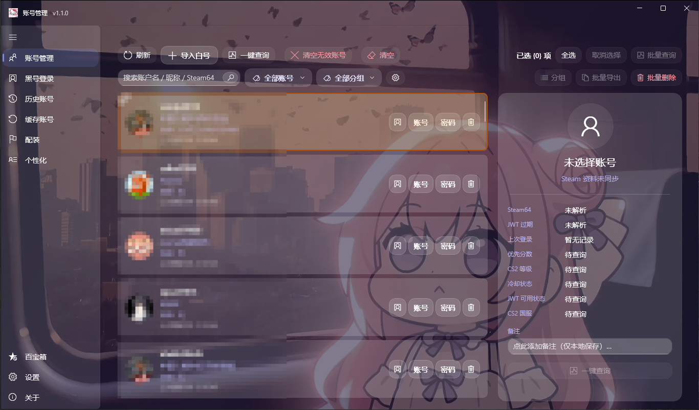
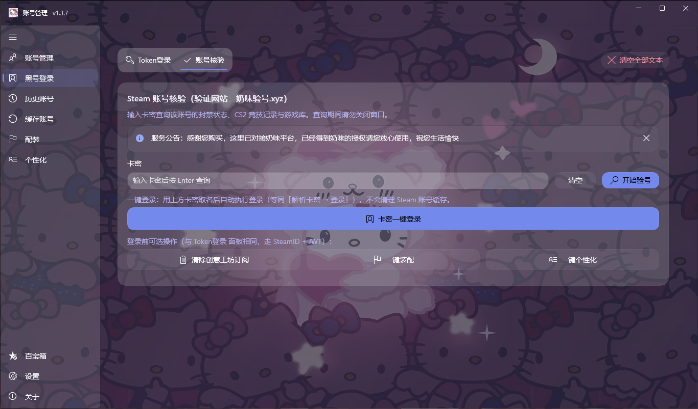
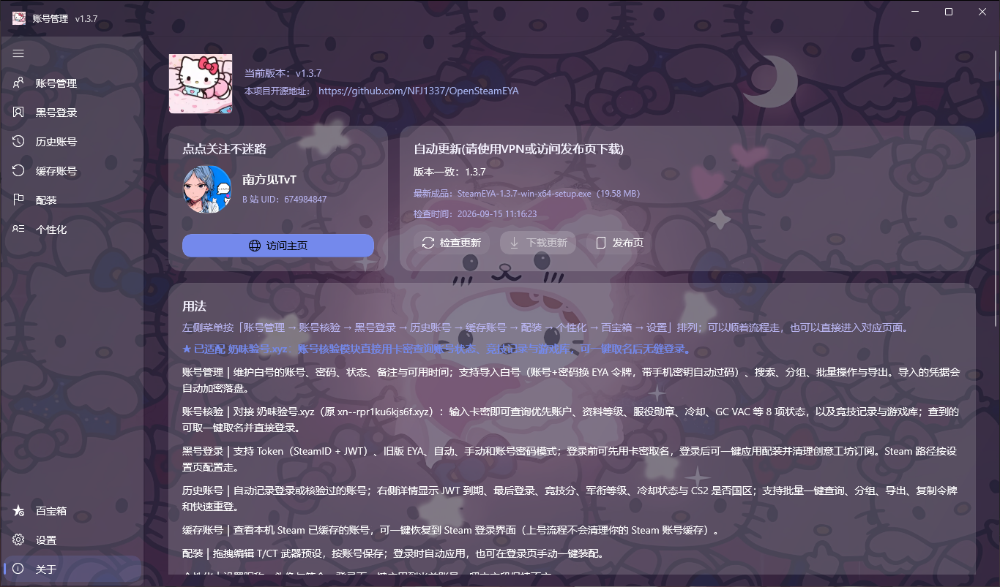

# SteamEYA

[中文](README.md) | [English](README_EN.md)

A Windows desktop tool for Steam account management/login with EYA tokens.

[![][latest-version-shield]][latest-version-link]
[![][github-downloads-shield]][github-downloads-link]
[![][github-stars-shield]][github-stars-link]
[![][github-license-shield]][github-license-link]

SteamEYA uses EYA tokens, a type of Steam login credential, to replace traditional account username and password logins, without the need to manually enter the password or manage Steam authenticators. Besides the login function, it can also check account status such as Premier rank, CS2 account level, and cooldown status, manage previously logged-in accounts, and clear Workshop subscriptions to prevent large downloads after logging in to a new account.

**👉 [Download the latest version from Releases](https://github.com/NFJ1337/OpenSteamEYA/releases)**

## Screenshots

<p align="center">
  <br><br>
  <br><br>
  
</p>

<h1>Nanfangjian Remastered Edition</h1>

This remastered edition fully rebuilds the UI and adds several practical custom features on top of the original version.

99.99% of this UI rebuild was written with DeepSeek AI. Please do not use it if you mind.

For bug reports, optimization suggestions, new feature requests, or source code requests, please contact me on QQ: 261064327.

> [!CAUTION]
> **Important Notice:**
>
> If you are concerned about account login errors or after-sales issues caused by using this software, please do not use it! Please do not use it! Please do not use it!
>
> This software is permanently free and open source. If anyone charges you under the name of this software, it is not the author's action. Please stay alert and beware of fraud.

If you need the original program, please visit the GitHub open-source project below.

> **Original Project**
>
> <https://github.com/hvh-software/OpenSteamEYA/>
>
> [](https://github.com/hvh-software/OpenSteamEYA/)

## Installation

1. Download the latest `SteamEYANFJ-<version>-win-x64-setup.exe` from [Releases](https://github.com/NFJ1337/OpenSteamEYA/releases).
2. Run the installer and finish the setup wizard.
3. Launch SteamEYA from Start Menu or Desktop shortcut.

Requirements: Windows 10 1809 (Build 17763) or later, with the Steam client installed. No additional runtime installation is required.

## FAQ

**The installer cannot be launched. What should I do?**

Check whether your security software blocks it, then re-download the latest installer from [Releases](https://github.com/NFJ1337/OpenSteamEYA/releases) and try again.

**What is an EYA token?**

An EYA token is a Steam login credential (JWT) that starts with `eyAi`. In manual mode, you can paste it directly to log in without an account password.

**Why did the account not switch after logging in?**

You need to fully exit the running Steam client before logging in. If Steam is running as administrator and this program is not, SteamEYA cannot close it. In that case, the program will ask you to exit Steam manually and retry.

## Build From Source

.NET 10 SDK and the Visual Studio C++ toolchain are required.

```bash
git clone https://github.com/NFJ1337/OpenSteamEYA.git
cd OpenSteamEYA
dotnet build SteamEyaWinUI/SteamEyaWinUI.csproj -c Release
```

Build installer (Inno Setup 6 required):

```powershell
./scripts/build-installer.ps1 -Version 1.1.0
```

## 🤝 Contributing

If you are interested in this project, contributions are welcome. A Star is also appreciated ^_^ <br>
Thanks to everyone who has opened and merged PRs for this project.

<a href="https://github.com/NFJ1337/OpenSteamEYA/graphs/contributors" target="_blank">
  <table>
    <tr>
      <th colspan="2">
        <br><br><br>
      </th>
    </tr>
  </table>
</a>

1. Fork this project.
2. Create a new branch: `git checkout -b feature/amazing-feature`
3. Commit your changes: `git commit -m "Add amazing feature"`
4. Push the branch: `git push origin feature/amazing-feature`
5. Open a Pull Request and wait for it to be merged.

## License

This project is open source under the [MIT License](LICENSE).

<!-- LINK GROUP -->

[latest-version-shield]: https://img.shields.io/github/v/release/hvh-software/OpenSteamEYA?style=flat-square&label=latest%20version&labelColor=black
[latest-version-link]: https://github.com/NFJ1337/OpenSteamEYA/releases
[github-downloads-shield]: https://img.shields.io/github/downloads/hvh-software/OpenSteamEYA/total?style=flat-square&logo=github&label=downloads&labelColor=black
[github-downloads-link]: https://github.com/NFJ1337/OpenSteamEYA/releases
[github-stars-shield]: https://img.shields.io/github/stars/hvh-software/OpenSteamEYA?style=flat-square&logo=github&labelColor=black
[github-stars-link]: https://github.com/NFJ1337/OpenSteamEYA/stargazers
[github-license-shield]: https://img.shields.io/github/license/hvh-software/OpenSteamEYA?style=flat-square&logo=github&labelColor=black
[github-license-link]: https://github.com/NFJ1337/OpenSteamEYA/blob/main/LICENSE
